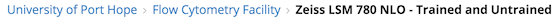
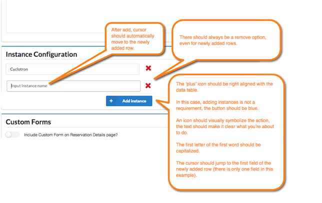
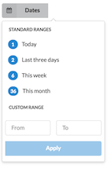
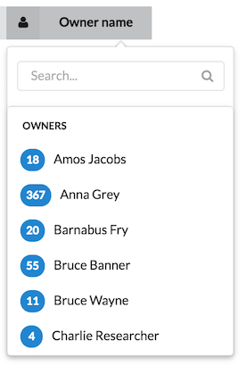
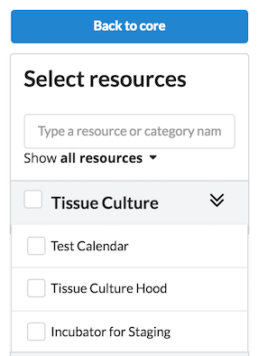
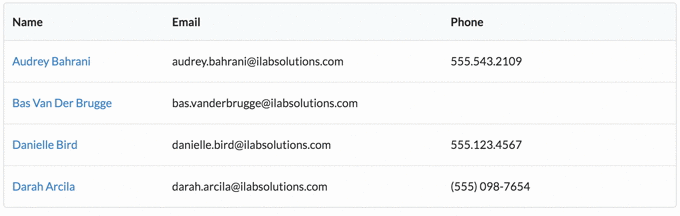
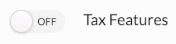
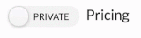

# iLab Design Guidelines

The iLab Design Guidelines are intended to create a uniform and intuitive standard for design. This guide will not solve every problem, but should serve as starting point to decision making.

---

1. [Visual Design](#visual-design)
  1. [Typography](#typography)
  2. [Capitalization](#capitalization)
  3. [Currency](#currency)
  4. [Date Formats](#date-formats)
  5. [Accessibility](#accessibility)
2. [Buttons and Actions](#buttons-and-actions)
  1. [Buttons and Icons](#buttons-and-icons)
3. [Inputs](#inputs)
4. [Filters & Navigation](#filters-and-navigation)
5. [Tables](#tables)
6. [Forms](#forms)
7. [Modals](#modals)
8. [Popups & Assistance](#popups-and-assistance)
9. [Checkboxes & Toggles](#checkboxes-and-toggles)
10. [Segments (a.k.a., Panels)](#segments)
11. [Labels](#labels)
12. [Title Text and Favicons](#title-text-and-favicons)

---


<a name="visual-design"></a>
## Visual Design

<a name="typography"></a>
### Typography
Typography heavily influences usability.
#### Code
```css
body {
  ...
  font-family: Lato,'Helvetica Neue',Arial,Helvetica,sans-serif;
  font-size: 14px;
  ...
}
```
#### Guidelines
- Use a base font size from semantic 14px for paragraph fonts. All other fonts should be scaled from this with rem or em.
- Use the default sans serif fonts in the Semantic package.
- iLab does not currently support multiple font styles and they should be avoided.
- A line 66 characters long, counting spaces characters and is generally considered the optimal size for a line’s length.

<a name="capitalization"></a>
### Capitalization
Use [consistent capitalization](https://www.nngroup.com/articles/113-design-guidelines-homepage-usability/). Capitalization conveys meaning (e.g., importance). Inconsistencies like capitalization can disorient users.

These are general guidelines for text within the app.
#### Guidelines
- Use sentence case when the text is a complete sentence (subject + predicate/verb + full stop punctuation). 
  - Sentences should be used to provide assistance to users.
- Use title case for headers, actions and labels.
- Avoid use of all caps because it slows down users making text difficult to read.
- Avoid use of all lowercase because it does not tell the user what is important and what is less important.

<a name="currency"></a>
### Currency
Many of iLab's views include financial information. Financial users have conventions for displaying currency and financial data that iLab should support.


#### Guidelines
- For USD, EUR, GBP, CAD, AUD and CHF, there should always be two digits after the radix (i.e., decimal point). Secondarily, European or other international users should be able to swap the radix and display of comma and decimal point delimiters. Currencies should always be preceded by their symbol $, €, even if a subtotal.
- For some currencies, that may not have a symbol like Norwegian krone, the label should be after.
- When calculating the items total cost, call the column with the calculated value "Amount".
- For some currencies, there should be no space between the symbol.
- For tables that have currencies, the table heading and the values should be right aligned, so that the decimal points are aligned.

<a name="date-formats"></a>
### Date Formats
Dates should be in the default format, ideally by user selected but potentially organizationally determined or at least defined by the locale.

Dates can take different formats in different contexts. For example, within the context of a weekly calendar, the date in the day’s column heading may be shortened to either Mon 3/14 or Mon 14/3.
#### Code

|    Code    |         Example      |          Label         |
|:----------:|:--------------------:|:----------------------:|
| yyyy/mm/dd |      2020/10/04      | ISO, default           |
| mm/dd/yyyy |      10/04/2020      | US, default            |
| dd/mm/yyyy |      04/10/2020      | International, default |
| %m %d      | Oct 4                | US/Intl., short        |
| %m %d      | Wed 15/12, Wed 12/15 | US/Intl. calendar      |
| %l:%M %p   | 4:41 AM, 4:42 PM     |                        |
| %h:%M      | 4:41, 16:42          |                        |

#### Guidelines
- Use the core's timezone by default.

<a name="alignment"></a>
### Alignment
#### Guidelines
- Avoid adjusting the indentation (e.g., padding-left)that is built into Semantic UI's CSS.
- Text should be left aligned, except in cases of tables (e.g., currency) and marketing.

<a name="color"></a>
### Color
Use grayscale first. After that, add one color to add focus. Add additional colors at your own peril.
#### Design Palette

To match iLab's enterprise-wide styling, please use the following colors. Please note that we are using the default colors from the [Semantic UI library](http://semantic-ui.com/introduction/getting-started.html) for most buttons.

| Name                       | Hex Code | Swatch |
|----------------------------|---------:|:------:|
| iLab Blue (main color)     | #548DD4  |  |
| Darker Blue                | #376092  |  |
| Darker Grey                | #777777  |  |
| Highlight Orange           | #FA7921  |  |
| Highlight/Background Grey  | #CCCCCC  |   |
| Dark Grey for Font         | #222222  |   |

#### Guidelines
- Use Semantic UI's default theme colors, but use them sparingly.


### Accessibility

We must take accessibility into account when designing and developing interfaces. iLab is reviewing the U.S. Governments [Section 508 Standards](http://www.section508.gov/content/learn/standards) as a potential guideline.

### Breadcrumbs
Use breadcrumbs to help give users a sense of where they are in iLab and help then navigate back and sideways.




<a name="buttons-and-actions"></a>
## Buttons and Actions
Buttons are to take actions on a form or other work.
#### Code
```haml
%button.ui.black.basic.button.cancel
  Back
%button.ui.primary.button
  Create Item
```
#### Guidelines
- The primary or recommended button should be colored (i.e., high contrast).
- The action that advances the users goal should be the furthest right.

<button class="ui black basic button cancel">
  Back
</button>
<button class="ui primary button">
  Create Item
</button>

- Actions should be grouped together to the right of the content, without being orphaned.
- Use title case as elaborated by the [OSX spec](https://developer.apple.com/library/mac/documentation/UserExperience/Conceptual/OSXHIGuidelines/TerminologyWording.html#//apple_ref/doc/uid/20000957-CH15-SW4)
- Secondary buttons should be [basic](http://semantic-ui.com/elements/button.html#basic) or links.
- Avoid using the standard button style. In a few usability tests, users have said that the button looks disabled. It's also much lower contrast and could cause accesibility issues.

<div class="ui button">
  Avoid this Button
</div>

- Avoid using the conditional button. The conditional button lacks visual distinction between the primary and secondary action.

<div class="ui buttons">
  <button class="ui negative button">Neither</button>
  <div class="or"></div>
  <button class="ui primary button">Nor</button>
</div>


<a name="buttons-and-icons"></a>
- When using [icons](https://uxplanet.org/icons-as-part-of-an-awesome-user-experience-e468e16b206b#4abb), use descriptive text with the icon.
  - For button locations where space is contrained, a sole icon may be used without text. This is only possible with icons that are universally understood like save, delete, search and edit. A heart or a star is an example with non-universal meaning.
  - Primay actions page should be labeled. Therefore, rows of a table that have an edit button may use the icon only.

<button class="ui black basic button">
  <i class="icon user"></i>
  Phone a Friend
</button>

- It's perfectly acceptable to use a link as a button.

  <a href="#">Add Comment</a>

#### Button Color and Styling Guidelines
Using the conventional and consistent button [colors and styling](http://uxmovement.com/buttons/how-button-color-contrast-guides-users-to-action/) speeds a user's work and prevents mistakes. First, identify what type of action button is taking:

- Positive: updates, sends or adds information.
- Positive plus redirect to new page.
- Neutral: makes no changes or goes back
- Negative: delete, destroy, remove or block information.

Second, identify the primary action:

- Usually the primary action is the positive action. 
- When positive and negative actions are together, make the positive the primary.

**Make the primary action the highest contrast and most prominent, placed furthest to the right.**

<button class="ui red basic button">
  Negative
</button>
<button class="ui primary button">Positive</button><i class="checkmark icon"></i>

<button class="ui black basic button">
  Neutral
</button>
<button class="ui negative button">Negative</button><i class="checkmark icon"></i>

<button class="ui black basic button">
  Neutral
</button>
<button class="ui red basic button">
  Negative
</button>
<button class="ui primary button">Positive</button><i class="checkmark icon"></i>

Reserve green for when a user will be redirected after taking the positive action.

<button class="ui black basic button">
  Back
</button>
<button class="ui red basic button">
  Remove Session
</button>
<button class="ui blue basic button">
  Start Session
</button>
<button class="ui green button">
  Start Session and Logout
</button><i class="checkmark icon"></i>

<a name="inputs"></a>
## Inputs
Inputs, specifically text, should direct the user as to what information should be entered.
#### Code


#### Guidelines
- [Size inputs](http://semantic-ui.com/collections/form.html#fields) to reflect the data that will be entered. For example, a phone number input should be 10 or 12 characters long.
- Make placeholder text the secondary label because it's often too low of contrast to ensure accessibility.
- Rows of inputs:
  - When adding a row of inputs, always place the cursor in the next row.
  - If removing the row only destroys or deletes a connection between two records, and is easily recovered, us a red "X" on the row.
  - If removing the row will destroy data that cannot be easily derived (e.g., name, date, PO number), use a trash can icon and display an alert warning.
  


<a name="filters-and-navigation"></a>
## Filters & Navigation
iLab uses many different types of filter controls and advanced search capabilities. In general, try to use one of the filter menus in the existing codebase.



#### Code
For secondary and tertiary navigation and filter panels, iLab uses [vertical menus](http://semantic-ui.com/collections/menu.html#vertical-menu).

#### Guidelines
- Place the menu or filter panel on the left hand side.
- Provide a way to clear search facets.
- Make the menu mobile friendly.
- If possible, provide a list of search facets being used (i.e., chips/tokens).
- Limit the number of options per facet so that the menu does not extend off the page on long lists.


#### Examples
Dropdown with text search and vertical facet with option search.




<a name="search"></a>
## Search
Search inputs are special types of [inputs](http://semantic-ui.com/elements/input.html#action).
<div class="ui action input">
  <input type="text" placeholder="Search all products">
  <button class="ui blue icon button">
    <i class="search icon"></i>
  </button>
</div>
#### Code
<!-- Search with Category Filter -->
Notice the border radius on the search input and the right hand search button. <form action="/" method="get">
  <div class="ui left action input">
    <div class="ui floating dropdown button initialized" tabindex="0">
      <div class="text">products</div>
      <i class="dropdown icon"></i>
      <div class="menu transition hidden">
        <div class="item active selected" value="p">products</div>
      </div>
    </div>
    <input id="q" name="q" placeholder="Search..." size="30" type="text" value="">
    <input id="" name="" type="hidden" value="p">
    <button class="ui icon button">
      <i class="search icon"></i>
    </button>
  </div>
</form>

To get the borders to look right on this search, add the following CSS:

```css
.ui.left.action.input input {
   border-top-right-radius: 0;
   border-bottom-right-radius: 0;
}
 
.ui.left.action.input input + button {
   border-top-right-radius: 0.285714rem;
   border-bottom-right-radius: 0.285714rem;
}
```

#### Guidelines
- If the primary means for interacting with the page is search, make sure it is prominent.
- Avoid using Semantic UI's fuzzy search. It's too loose on word distances and is not easily adjustable.
- Add placeholder text that provides context despite it being low contrast.

<a name="tables"></a>
## Tables
[Tables](http://semantic-ui.com/collections/table.html#single-line) are best for organizing structured datasets where each row represents a record.
#### Code
A basic striped table

```haml
%table.ui.striped.table
  %thead
    %tr
      %th Item
      %th Description
      %th.right.aligned Qty
      %th.right.aligned Unit Price
      %th.right.aligned Amount
  %tbody
    %tr
      %td Scans
      %td CT Scan
      %td.right.aligned 20
      %td.right.aligned 30.00
      %td.right.aligned 600.00
```		
You may also include a footer that includes information like a total or summary.

```haml
%tfoot
  %tr
    %th 3 People
    %th 2 Approved
    %th
```	  
Here's the CSS to make rows hover-able

```css
tr i.fa-pencil-square-o {
   visibility: hidden;
}
tr:hover i.fa-pencil-square-o {
   visibility: visible;
}
```

#### Guidelines
- Tables should be minimally responsive or scrollable for small widths.
- Actions on a table row should not be visible unless the row is hovered by a user.



- Use the datatables.net filter 
- Zebra-striping tables is OK. [Research][zebra] indicates that zebra striping does not improve speed or accuracy of answering questions with data, although users do indicate an aesthetic preference for zebra striping.
- Never use the ribbon label `class="ui ribbon label"`

[zebra]: http://alistapart.com/article/zebrastripingmoredataforthecase

<table class="ui striped table">
  <thead>
    <tr>
      <th>Item</th>
      <th>Description</th>
      <th class="right aligned">Qty</th>
      <th class="right aligned" >Unit Price</th>
      <th class="right aligned">Amount</th>
    </tr>
  </thead>
  <tbody>
    <tr>
      <td>Scans</td>
      <td>CT Scan</td>
      <td class="right aligned">20</td>
      <td class="right aligned">30.00</td>
      <td class="right aligned">600.00</td>
    </tr>
    <tr>
      <td>Scans</td>
      <td>MRI</td>
      <td class="right aligned">20</td>
      <td class="right aligned">30.00</td>
      <td class="right aligned">600.00</td>
    </tr>
    <tr>
      <td>Services</td>
      <td>Scans Services</td>
      <td class="right aligned">5</td>
      <td class="right aligned">50.00</td>
      <td class="right aligned">250.00</td>
    </tr>
    <tr>
      <td>Services</td>
      <td>Scans Services</td>
      <td class="right aligned">5</td>
      <td class="right aligned">50.00</td>
      <td class="right aligned">250.00</td>
    </tr>
    <tr>
      <td>Services</td>
      <td>Scans Services</td>
      <td class="right aligned">5</td>
      <td class="right aligned">50.00</td>
      <td class="right aligned">250.00</td>
    </tr>
    <tr>
      <td>Services</td>
      <td>Scans Services</td>
      <td class="right aligned">5</td>
      <td class="right aligned">50.00</td>
      <td class="right aligned">250.00</td>
    </tr>
    <tr>
      <td>Services</td>
      <td>Scans Services</td>
      <td class="right aligned">5</td>
      <td class="right aligned">50.00</td>
      <td class="right aligned">250.00</td>
    </tr>
    <tr>
      <td>Services</td>
      <td>Scans Services</td>
      <td class="right aligned">5</td>
      <td class="right aligned">50.00</td>
      <td class="right aligned">250.00</td>
    </tr>
  </tbody>
  <tfoot>
  <tr>
    <th colspan="4" class="right aligned">
      <strong>Grand Total</strong>
    </th>
    <th class="right aligned">
      <strong>$2700.00</strong>
  </th>
  </tfoot>
</table>


<a name="forms"></a>
## Forms
[Forms](http://semantic-ui.com/collections/form.html) are an essential way users interact with iLab and they are how users achieve their goals. Therefore, iLab forms should be straightforward and fast to complete.
#### Code
Creating fields that are not the full width of the grid

```haml
.ui.form
  %h4.ui.header Reservation Time
  .fields
    .five.wide.field
      %label Minimum Minutes
      %input{:placeholder => "Min.", :type => "text"}
    / five wide field
    .five.wide.field
      %label Maximum Minutes
      %input{:placeholder => "Max.", :type => "text"}
    / five wide field
```


#### Guidelines
- Forms should be a single column, except for things like first name and last name or city and post code or other related data.

<div class="ui form">
  <h4 class="ui header">Reservation Time</h4>
  <div class="fields">
    <div class="five wide field">
        <label>Minimum Minutes</label>
        <input type="text" placeholder="Min.">
    </div> <!-- five wide field -->
    <div class="five wide field">
        <label>Maximum Minutes</label>
        <input type="text" placeholder="Max.">
    </div> <!-- five wide field -->
  </div>
</div>

- Avoid using sentences [in form labels](https://uxplanet.org/designing-more-efficient-forms-structure-inputs-labels-and-actions-e3a47007114f#.3db8lwnvg).
- Use help text to assist users in completing forms. Typically this should be placed in a popup.
- Use the [right case](https://developer.apple.com/library/mac/documentation/UserExperience/Conceptual/OSXHIGuidelines/TerminologyWording.html#//apple_ref/doc/uid/20000957-CH15-SW4)
  - Use Title Case for labels. For example: "Header Logo", "Header Height", "Tab Color"
- Checkboxes, toggles, and radio buttons may have labels that use sentence case, even if they are not complete sentences.
- Use a button labeled Back, since that is a normal way to interact with web applications.
- Avoid Cancel buttons.
- Never use [Reset buttons](https://www.nngroup.com/articles/reset-and-cancel-buttons/).

Reference: Here's some [excellent research and guidance](http://www.slideshare.net/cjforms/labels-and-buttons-on-forms) for buttons and labels on building good forms.


<a name="modals"></a>
## Modals
[Modals](http://semantic-ui.com/modules/modal.html#size) prevent users from interacting with the background while focusing on a specific task. For modals iLab uses a Semantic modal and the Magnific popup library. All new work should use the Semantic version.

Modals should be cancelled by three methods: (1) click a cancel button, (2) hit escape on the keyboard, (3) click outside of the modal on the window overlay.

#### Code
The basic init for a [modal](http://semantic-ui.com/modules/modal.html#modal).
	$('.ui.modal')
	  .modal()
	;

#### Guidelines

- Place an X inside the upper right hand corner of the modal.
- [Size](http://semantic-ui.com/modules/modal.html#size) modals to the content. Use large for more details or image content. Use small for content usually placed in alerts (e.g., "Do you want to set your password?")
- Never change the animation or the background options (e.g., no blur).
 

More guidelines:

Apple provides [succinct guidance](https://developer.apple.com/library/ios/documentation/UserExperience/Conceptual/MobileHIG/Modal.html) in it's iOS Human Interface Guidelines:

> Keep modal tasks simple, short, and narrowly focused. You don’t want your users to experience a modal view as a mini app within your app. If a subtask is too complex, people can lose sight of the main task they suspended when they entered the modal context. Be especially wary of creating a modal task that involves a hierarchy of views, because people can get lost and forget how to retrace their steps. If a modal task must contain subtasks in separate views, be sure to give users a single, clear path through the hierarchy, and avoid circularities. For guidelines on using modal views, see Modal View.

> Always provide an obvious and safe way to exit a modal task. People should always be able to predict the fate of their work when they dismiss a modal view.

<a name="popups-and-assistance"></a>
## Popups & Assistance
Popups provide additional information and assistance to help users complete their work.
#### Code
	
	<i 
	  class="circular info icon link blue" 
	  data-content="Hello. This is helpful message" 
	  data-variation="">
	</i>
	
#### Guidelines
- Use popups to provide assistance to users to complete the goal.
- Please make text easy to understand and focused.

<a name="checkboxes-and-toggles"></a>
## Checkboxes & Toggles
Checkboxes and toggles are used for options.

 

#### Guidelines

- Use the checkbox for multi-select list situations.
- Use the toggle boolean settings. On/off, true/false, public/private.
- Avoid using the radio button for a single option.
- Positive or on should be green. Negative or off should be grey. There are few exceptions.
- Place the label on the right hand side.
- Labels could be full sentences or incomplete sentence.
- Add text to the toggle clarifying that is “On” or “Off”.
- Label things in the affirmative. For example:
  - **Do not hide banner message (UNCLEAR)**
  - **Hide banner message (CLEARER)**

  - **Show banner message (CLEAR)**
- Never include question marks in labels. For example:
  - "**Turn on airplane mode?**" vs. "**Airplane Mode**"
  - "**Activate Tax Feature?**" vs. "**Tax Features**"
 


<a name="segments"></a>
## Segments (a.k.a. Panels)
[Segments](http://semantic-ui.com/elements/segment.html#colored) group and divide content. We are using the 

#### Code
```html
<div class="ui blue segment"></div>
```
#### Guidelines
- Use the blue highlight.

<div class="ui blue segment">iLab Solutions</div>

- Avoid using too many nested panels. You will end up with corners that have many borders. This also suggests an overly complex design.

<a name="labels"></a>
## Labels
Use labels sparingly. Labels draw a user's attention so they should only be used to highlight things that are new or important.

#### Guidelines
- Use [labels][label-reference] to draw attention to content.
 
<div class="ui blue label">NEW</div> <strong>Track all the publications associated with your core</strong>

- Use labels as tokens for tagging things, like email contacts, usually not displaying more thant a ten to twelve items.

[label-reference]: https://standards.usa.gov/labels/

<a name="title-text-and-favicons"></a>
## Title Text and Favicons
Pages should always have title text and favicons. Title text is important to iLab users since they frequently have multiple tabs open at the same time to complete their work.



#### Guidelines
- The favicon may be a different color depending on environment (e.g., Staging)
- Title Tag Text should be of the format &nbsp; **`Activity<: Acting On> | iLab`**

Examples
- Equipment Edit: Flow Cytometer | iLab
- Confirm Usage: Chemistry Core | iLab
- Favorites | iLab

## Date Picker
Use the jQuery Date Picker with the Semantic UI styling
#### Code

#### Guidelines
- For Semantic datepickers, use the latest provided by Taras D.

## Color Picker
There are two color pickers in iLab. One of them is not very useful. The other is based on an autocomplete dropdown.


## References

1. Block, Element, Modifier ([BEM](https://css-tricks.com/bem-101/))
2. 18F U.S. [Design Standards](https://playbook.cio.gov/designstandards/visual-style/)
3. [iOS Human Interface Guidelines](https://developer.apple.com/library/mac/documentation/UserExperience/Conceptual/OSXHIGuidelines/TerminologyWording.html#//apple_ref/doc/uid/20000957-CH15-SW4) (Accessed Apr 2016)
4. [OS X Human Interface Guidelines](https://developer.apple.com/library/mac/documentation/UserExperience/Conceptual/OSXHIGuidelines/index.html#//apple_ref/doc/uid/20000957-CH3-SW1) (Accessed  Apr 2016)


